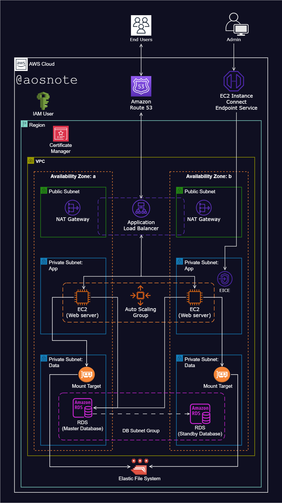

---
# Hosting a WordPress Website on AWS

This project demonstrates how to host a WordPress website on Amazon Web Services (AWS). It involves configuring various AWS services to ensure high availability, scalability, and security for the WordPress application. This repository includes a reference diagram and deployment scripts used to set up the WordPress web app on an EC2 instance.

## Architecture Overview

The WordPress website is hosted on EC2 instances within a highly available and secure architecture that includes:

1. **Virtual Private Cloud (VPC)**: Configured with public and private subnets across two Availability Zones (AZs) for fault tolerance and high availability.
2. **Internet Gateway**: Facilitates connectivity between instances in the VPC and the internet.
3. **Security Groups**: Act as a virtual firewall to control inbound and outbound traffic.
4. **Public Subnets**: Used for the NAT Gateway and Application Load Balancer.
5. **Private Subnets**: Used for web servers to enhance security.
6. **EC2 Instance Connect Endpoint**: Provides secure SSH access to instances within both public and private subnets.
7. **Application Load Balancer**: Distributes web traffic to multiple EC2 instances in an Auto Scaling Group across multiple AZs.
8. **Auto Scaling Group**: Manages the number of EC2 instances based on traffic, ensuring scalability and resilience.
9. **Amazon RDS**: Managed relational database service for WordPress.
10. **Amazon EFS**: Scalable file storage system for shared web files.
11. **AWS Certificate Manager**: Manages SSL/TLS certificates to secure application communications.
12. **AWS Simple Notification Service (SNS)**: Provides notifications about Auto Scaling Group activities.
13. **Amazon Route 53**: Domain name registration and DNS management.

### Scripts

#### WordPress Installation Script

This script is included in the launch template for the Auto Scaling Group, ensuring that new instances are configured correctly with the necessary software and settings.

```bash
#!/bin/bash

# Create to root user
sudo su

# Update the software packages on the EC2 instance
sudo yum update -y

# Create an html directory
sudo mkdir -p /var/www/html

# Environment variable
EFS_DNS_NAME=fs-064e9505819af10a4.efs.us-east-1.amazonaws.com

# Mount the EFS to the html directory
sudo mount -t nfs4 -o nfsvers=4.1,rsize=1048576,wsize=1048576,hard,timeo=600,retrans=2,noresvport "$EFS_DNS_NAME":/ /var/www/html

# Install Apache, enable it to start on boot, and start the server
sudo yum install -y httpd
sudo systemctl enable httpd
sudo systemctl start httpd

# Install PHP 8 and necessary extensions for WordPress
sudo dnf install -y \
php \
php-cli \
php-cgi \
php-curl \
php-mbstring \
php-gd \
php-mysqlnd \
php-gettext \
php-json \
php-xml \
php-fpm \
php-intl \
php-zip \
php-bcmath \
php-ctype \
php-fileinfo \
php-openssl \
php-pdo \
php-tokenizer

# Install MySQL 8 community repository
sudo wget https://dev.mysql.com/get/mysql80-community-release-el9-1.noarch.rpm
sudo dnf install -y mysql80-community-release-el9-1.noarch.rpm
sudo rpm --import https://repo.mysql.com/RPM-GPG-KEY-mysql-2023
sudo dnf repolist enabled | grep "mysql.*-community.*"
sudo dnf install -y mysql-community-server

# Start and enable MySQL server
sudo systemctl start mysqld
sudo systemctl enable mysqld

# Set permissions
sudo usermod -a -G apache ec2-user
sudo chown -R ec2-user:apache /var/www
sudo chmod 2775 /var/www && find /var/www -type d -exec sudo chmod 2775 {} \;
sudo find /var/www -type f -exec sudo chmod 0664 {} \;
chown apache:apache -R /var/www/html

# Download WordPress files
wget https://wordpress.org/latest.tar.gz
tar -xzf latest.tar.gz
sudo cp -r wordpress/* /var/www/html/

# Create the wp-config.php file
sudo cp /var/www/html/wp-config-sample.php /var/www/html/wp-config.php

# Edit the wp-config.php file
sudo vi /var/www/html/wp-config.php

# Restart the web server
sudo service httpd restart
```
## How to Use

1. Clone this repository to your local machine.
2. Follow the AWS documentation to create the required resources (VPC, subnets, Internet Gateway, etc.) as outlined in the architecture overview.
3. Use the provided scripts to set up the WordPress application on EC2 instances within the VPC.
4. Configure the Auto Scaling Group, Load Balancer, and other services as per the architecture.
5. Access the WordPress website through the Load Balancer's DNS name.

## Contributing

Contributions to this project are welcome. Please fork the repository and submit a pull request with your enhancements.

## License

This project is licensed under the MIT License. See the [LICENSE](LICENSE) file for details.

---
